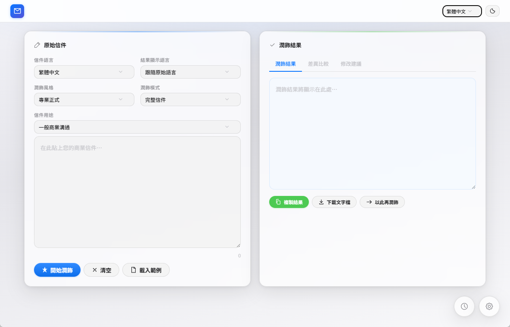

# 商業信件潤飾工具 / Letter Polisher

支援各家 API 的個人版商業信件潤飾工具。



## 快速開始

直接執行 `商業信件潤飾工具.exe` 即可使用。首次執行會自動顯示引導設定精靈。

## 功能特色

- **玻璃質感風格** — 優雅的毛玻璃介面，支援亮色 / 暗色模式切換
- **多語言介面** — 繁體中文、簡體中文、English，自動偵測系統語言
- **各家 API** — OpenAI、Anthropic、Google Gemini、Groq、DeepSeek、自架 LLM
- **API 格式** — OpenAI 相容 / Anthropic / Gemini
- **自訂風格與用途** — 自由描述想要的語氣與信件用途
- **語言與地區控制** — 分別指定原始信件語言／地區與結果顯示語言／地區，AI 依當地用字、拼寫與商務書寫慣例輸出
- **差異比較** — 原文 vs 潤飾結果並列
- **修改建議** — AI 自動附上修改說明
- **歷史紀錄** — 浮動按鈕 + 側邊面板
- **設定持久化** — localStorage 保存，重開不失效
- **線上更新檢查** — 設定面板可檢查新版本

## 檔案結構

```
商業信件潤飾工具/
├── 商業信件潤飾工具.exe          主程式
├── 商業信件潤飾工具.exe.config    .NET 設定檔
├── SetupWizard.exe               安裝精靈（圖形化介面）
├── letter-polisher.html          介面（HTML+CSS+JS）
├── icon.ico                      應用程式圖示
├── version.json                  版本資訊（線上更新用）
├── WebView2Loader.dll            WebView2 載入器
├── Microsoft.Web.WebView2.Core.dll
├── Microsoft.Web.WebView2.WinForms.dll
├── build-package.ps1             打包發行版腳本
├── runtime/                      WebView2 Chromium Runtime（約 500MB）
├── README.md                     本說明文件
└── user_data/                    使用者資料（自動建立）
```

## 使用說明

1. 點擊右下角 ⚙ 齒輪設定 API
2. 選擇預設或手動輸入 API 端點、Key、模型
3. 儲存並測試連線
4. 在左側輸入信件，選擇風格與用途
5. 點「開始潤飾」

## 快捷鍵

- `Ctrl+Enter` — 在輸入框中直接潤飾
- `Esc` — 關閉面板 / 彈窗

## 系統需求

- Windows 10/11（64-bit）
- 無需安裝任何軟體

---

## 在其他電腦上使用

### 方式一：執行安裝精靈（推薦）

1. 將整個 `商業信件潤飾工具` 資料夾複製到目標電腦（或解壓縮 ZIP）
2. 雙擊執行 `SetupWizard.exe`
3. 按照精靈指示完成安裝：
   - 選擇安裝路徑（預設 `%LocalAppData%\BusinessLetterPolisher`）
   - 自動偵測 WebView2 Runtime
   - 自動建立桌面捷徑
4. 安裝完成後可選擇立即啟動

### 方式二：直接執行主程式

1. 將資料夾複製到目標電腦
2. 直接執行 `商業信件潤飾工具.exe`
3. 首次使用會自動顯示引導設定

### 方式三：打包成 ZIP 分發

執行打包腳本：

```powershell
powershell -ExecutionPolicy Bypass -File build-package.ps1
```

會在 `dist/` 資料夾產生 `BusinessLetterPolisher-v{日期}.zip`，解壓縮即可使用。

### SetupWizard.exe 安裝精靈功能

| 功能 | 說明 |
|------|------|
| 自訂安裝路徑 | 預設安裝到 `%LocalAppData%\BusinessLetterPolisher`，可自選 |
| WebView2 Runtime | 自動偵測，有則複製，無則使用系統已安裝版本 |
| 桌面捷徑 | 選項，預設開啟 |
| 安裝後啟動 | 選項，預設開啟 |
| 進度顯示 | 即時顯示複製進度與目前檔案 |

---

## 線上更新機制

本工具支援線上檢查新版本。以下是設定與部署方法。

### 架構說明

```
┌─────────────┐     fetch(version.json)     ┌──────────────────┐
│  使用者電腦   │ ──────────────────────────► │  GitHub / 網站     │
│  (App)      │ ◄────────────────────────── │  (version.json)   │
│             │     比較版本號               │                   │
└─────────────┘                              └──────────────────┘
       │
       │ 版本較新時
       ▼
  confirm() → 開啟下載頁面 → 使用者手動下載
```

### 原理

App 啟動時不會自動更新。使用者在設定面板點擊「檢查更新」按鈕時：

1. App 從遠端下載 `version.json`
2. 比較遠端版本號與本地版本號（語意化版本）
3. 若有新版本，彈出確認對話框
4. 使用者確認後開啟下載頁面

### 部署步驟

#### 1. 建立 GitHub Repository

建立一個公開的 GitHub Repository，例如：
`https://github.com/YOUR_USERNAME/BusinessLetterPolisher`

#### 2. 上傳發行版

執行打包腳本後，將 ZIP 檔案上傳到 GitHub Releases：

```bash
git tag v2026.08.18
git push origin v2026.08.18
```

在 GitHub 上建立 Release，上傳 ZIP 檔案作為 Asset。

#### 3. 上傳 version.json

將 `version.json` 放到 Repository 的 main 分支，或放在任何可公開存取的 URL：

```json
{
  "version": "2026.08.18",
  "release_date": "2026-08-18",
  "min_app_version": "2026.08.18",
  "download_url": "https://github.com/YOUR_USERNAME/BusinessLetterPolisher/releases/latest/download/BusinessLetterPolisher.zip",
  "release_notes_url": "https://github.com/YOUR_USERNAME/BusinessLetterPolisher/releases/latest",
  "release_notes": {
    "zh-TW": "修復引導頁面 HTML 標籤顯示問題",
    "en": "Fix guide page HTML tag rendering issue"
  }
}
```

#### 4. 修改 App 的 UPDATE_URL

在 `letter-polisher.html` 中找到：

```javascript
var UPDATE_URL='https://raw.githubusercontent.com/YOUR_USERNAME/YOUR_REPO/main/version.json';
```

將其改為你的 `version.json` 實際 URL。

#### 5. 重新編譯 EXE

```powershell
C:\Windows\Microsoft.NET\Framework64\v4.0.30319\csc.exe /target:winexe /win32icon:icon.ico /out:商業信件潤飾工具.exe /reference:Microsoft.Web.WebView2.Core.dll /reference:Microsoft.Web.WebView2.WinForms.dll /reference:System.IO.Compression.dll /reference:System.IO.Compression.FileSystem.dll App.cs
```

### 版本號格式

版本號格式為 `YYYY.MM.DD`（例如 `2026.08.18`）。

每次發版時：
1. 更新 `version.json` 中的 `version` 欄位
2. 更新 `letter-polisher.html` 中的 `APP_VERSION` 變數
3. 更新 `version.json` 中的 `release_notes`（多語言）

### version.json 欄位說明

| 欄位 | 類型 | 說明 |
|------|------|------|
| `version` | string | 版本號（YYYY.MM.DD） |
| `release_date` | string | 發行日期 |
| `min_app_version` | string | 最低相容版本 |
| `download_url` | string | ZIP 下載網址 |
| `release_notes_url` | string | Release 頁面網址 |
| `release_notes` | object | 多語言更新說明 |

### 替代方案

如果不想用 GitHub，也可以使用：

- **任何 HTTP 伺服器**：將 `version.json` 放到網站上
- **Google Drive**：設定為公開分享，使用直接下載連結
- **自己的伺服器**：上傳到任意 HTTPS 站點

關鍵要求：`version.json` 必須可以透過 **HTTPS** 存取（WebView2 的 fetch 限制）。

### 安全注意事項

- 版本比較只在使用者手動觸發時執行
- 不會自動下載或安裝任何檔案
- 下載由使用者在瀏覽器中手動完成
- API Key 等設定存在本地 localStorage，不會隨更新傳送

---

## 從原始碼編譯

需要 .NET Framework 4.x（Windows 內建）：

### 主程式

```powershell
C:\Windows\Microsoft.NET\Framework64\v4.0.30319\csc.exe /target:winexe /win32icon:icon.ico /out:商業信件潤飾工具.exe /reference:Microsoft.Web.WebView2.Core.dll /reference:Microsoft.Web.WebView2.WinForms.dll /reference:System.IO.Compression.dll /reference:System.IO.Compression.FileSystem.dll App.cs
```

> 只要改過 `App.cs`（例如線上更新流程、下載進度回報），發行前**務必重新執行這個編譯指令**，否則打包出去的 exe 仍是舊的，線上更新會失效。

### 安裝精靈

```powershell
C:\Windows\Microsoft.NET\Framework\v4.0.30319\csc.exe /target:winexe /out:SetupWizard.exe /r:System.Windows.Forms.dll /r:System.Drawing.dll SetupWizard.cs
```

WebView2 NuGet 套件可從 https://www.nuget.org/packages/Microsoft.Web.WebView2 下載。
